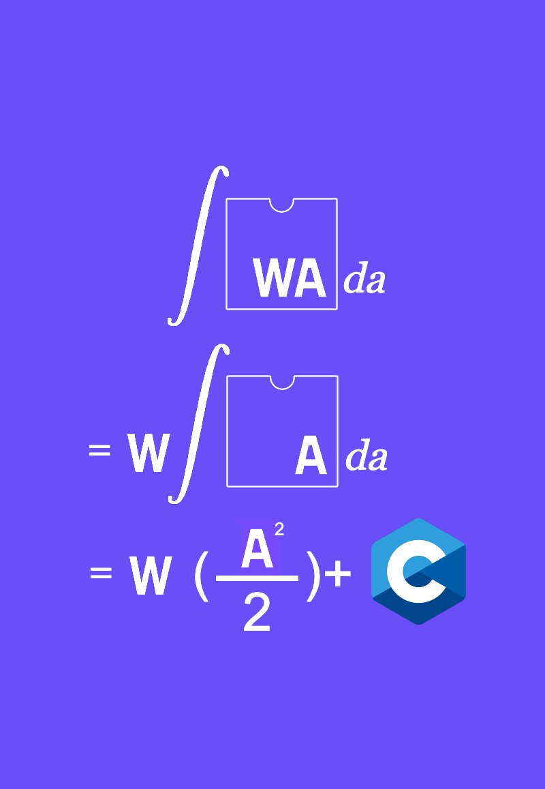

<center>

</center>

# cc-alculus
a webassembly compiler. compiles a simple c-like language into webassembly.  
cc-alculus was supposed to be a 1:1 c compiler but i honestly dont know enough about compilers to be able to write a half decent parser which can support
all the intricacies and weird-ness of the language.

### update
i wrote a lot of this code a long time ago and since then i have learned how to write it better.  
the code i had written was suboptimal and frankly pretty bad and im considering scrapping the parser and rewriting it.  
as far as im concerned the tokenizer is ok but the parser is messy and it would probably be faster to rewrite it and then continue with adding features.  

### planned support
im going to try and add enough to the compiler so that it is able to run the basic c code that made it. because it compiles to webassembly (is that considered transpilation? idk) it would allow for c code to run in the browser. screw emscripten.  

until then, this is the basic test file
```c
int main() {
    int x = 0;

    x++;

    if (x != 1) {
        // this isnt right...
        // i would output this to the console but there is no stdout
        // i guess ill just return 1
        return 1;
   }

   return 0;
}
```

### why?
sometimes reinventing the wheel is fun. im writing this for chasm2 but i might write
an alternative version that emits machine code instead of webassembly.  
also, this is my *official* successor to the [gamma-lang](https://github.com/TheCalculus/gamma-lang).
i didn't really get around to writing [thole](https://github.com/TheCalculus/gamma-lang#:~:text=Next%20up%3A%20The%20Thole%20Programming%20Language%20(work%20in%20progress)).
